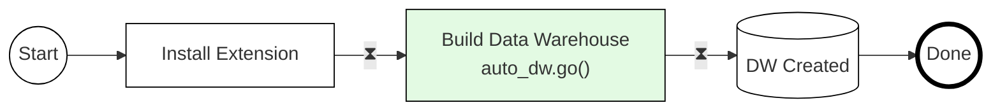
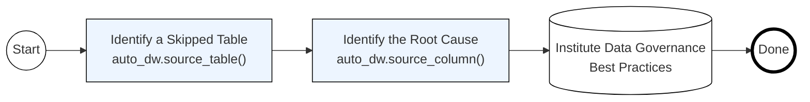
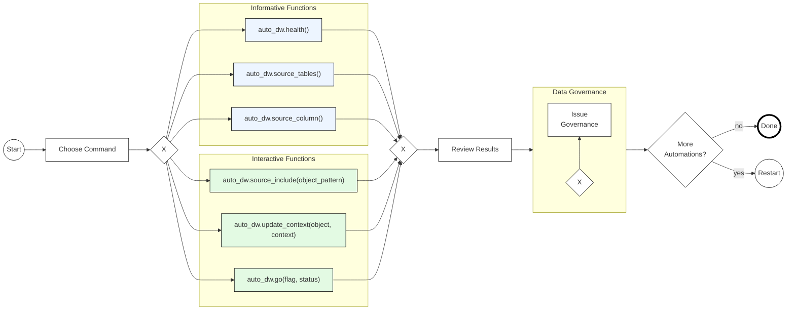

   # PG_AUTO_DW


[Open-source](LICENSE) PostgreSQL Extension for Automated Data Warehouse Creation

[](https://join.slack.com/t/tembocommunity/shared_invite/zt-277pu7chi-NHtvHWvLhHwyK0Y5Y6vTPw)
[](https://ossrank.com/p/4020)

## Background

From [@ryw](https://github.com/ryw) 4-18-24:

> This project attempts to implement an idea I can't shake - an auto-data warehouse extension that uses LLM to inspect operational Postgres schemas, and sets up automation to create a well-formed data warehouse (whether it's Data Vault, Kimball format, etc I don't care - just something better than a dumb dev like me would build as a DW - a pile of ingested tables, and ad-hoc derivative tables). I don't know if this project will work, but kind of fun to start something without certainty of success. But I have wanted this badly for years as a dev + data engineer.

## Project Vision
To create an open source extension that automates the data warehouse build.  We aim to do this within a structured environment that incorporates best practices and harnesses the capabilities of Large Language Models (LLM) technologies.

**Goals:** This extension will enable users to: 
- Automate the DW Build
- Automate DW Maintenance  
- Understand DW Health
- Support Data Governance

All these capabilities will be delivered through a [small set of intuitive functions](docs/sql_functions/readme.md).

## Principles
* Build in public
    * Public repo
    * Call attention/scrutiny to the work - release every week or two with blog/tweet calling attention to your work
* Documentation-driven development
    * While you’re writing code, write docs on how the product works
* Demo-driven development (recursive, go back to step 1 as needed. It's OK to get things wrong and iterate.)
    * Step 1 - write demo script
    * Step 2 - document vision + demo script in public README
    * Step 3 - mock up demo (fake UX)
    * Step 4 - make fake demo real (narrow use case)
    * Step 5 - ship v0.1 (SemVer) that can do a little more than just the pre-canned demo
        * Ship product + demo video + documentation

## Data Vault
We are starting with automation to facilitate a data vault implementation for our data warehouse. This will be a rudimentary raw vault setup, but we hope it will lead to substantial downstream business models.

## Timeline
We're currently working on a timeline to define points of success and ensure the smooth integration of new contributors to our project. This includes creating milestones, contributor guidelines, and hosting activities such as webinars and meetups. Stay tuned!

## Installation
We are currently developing a new extension, starting with an initial set of defined [functions](docs/sql_functions/readme.md) and implementing a subset in a mockup extension. This version features skeletal implementations of some functions, designed just to demonstrate our envisioned capabilities as seen in the demo. Our demo is divided into two parts: Act 1 and Act 2.  If you follow along, I hope this will offer a glimpse of what to expect in the weeks ahead.

If you’re interested in exploring this preliminary version, please follow these steps:

1) [Install Rust](https://doc.rust-lang.org/book/ch01-01-installation.html)
2) [Install PGRX](https://github.com/pgcentralfoundation/pgrx)
3) Run this Codebase

## Demo: Act 1 - "1-Click Build"
> **Note:** Only use the code presented below. Any deviations may cause errors. This demo is for illustrative purposes only.

We want to make building a data warehouse easy.  And, if the source tables are well-structured and appropriately named, constructing a data warehouse can be achieved with a single call to the extension.

1. **Install Extension**
```SQL
/* Installing Extension - Installs and creates sample source tables. */
CREATE EXTENSION pg_auto_dw;
```
2. **Build Data Warehouse**
```SQL
/* Build me a Data Warehouse for tables that are Ready to Deploy */
SELECT auto_dw.go();
```
3. **Data Warehouse Built**
```SQL
/* Data Warehouse Built - No More Code Required */
```



## Demo: Act 2 - “Auto Data Governance”
Sometimes it’s best to get a little push-back when creating a data warehouse, which supports appropriate data governance.  In this instance a table was not ready to deploy to the data warehouse as a table column may need to be considered sensitive and handled appropriately.  In this sample script, Auto DW’s engine understands the attribute is useful for analysis, but also may need to be considered sensitive.  In this script the user will:
1) **Identify a Skipped Table**
```SQL
/* Identify source tables skipped and not integration into the data warehouse. */
SELECT schema, "table", status, status_response 
FROM auto_dw.source_table()
WHERE status_code = 'SKIP' ;
```
2) **Identify the Root Cause**
```SQL
/* Identify the source table column that caused the problem, understand the issue, and potential solution. */
SELECT schema, "table", "column", status, confidence_level, status_response
FROM auto_dw.source_column()
WHERE schema = 'PUBLIC' AND "table" = 'CUSTOMER';
```
3) **Decide to Institute Some Data Governance Best Practices**
```SQL
/* Altering column length restricts the acceptance of extended ZIP codes.*/
ALTER TABLE customer ALTER COLUMN zip TYPE VARCHAR(5);
```

**Auto DW Process Flow:** The script highlighted in Act 2 demonstrates that there are several approaches to successfully implementing a data warehouse when using this extension. Below is a BPMN diagram that illustrates these various paths.

