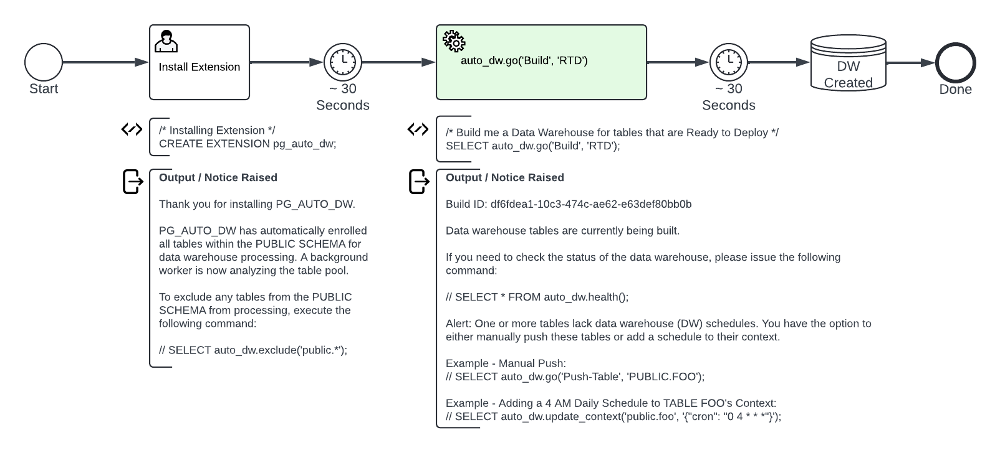

## Vision and Script
***Project Vision:*** To create an open source extension that automates the data warehouse build.  We aim to do this within a structured environment that incorporates best practices and harnesses the capabilities of Large Language Modes (LLM) technologies.

***Goal:*** This extension will enable users to: 
- Automate the DW Build
- Automate DW Maintenance  
- Understand DW Health
- Support Data Governance

All these capabilities will be delivered through a [small set of intuitive functions](../sql_functions/readme.md).

***Script 1:*** We want to make building a data warehouse easy.  And if the source tables are structured well and appropriately named, it should take two steps. 
1) Install Extension
2) Build Data Warehouse

