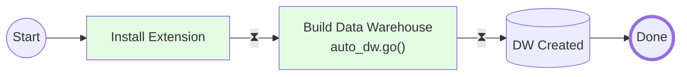

## Vision and Script
**Project Vision:** To create an open source extension that automates the data warehouse build.  We aim to do this within a structured environment that incorporates best practices and harnesses the capabilities of Large Language Modes (LLM) technologies.

**Goal:** This extension will enable users to: 
- Automate the DW Build
- Automate DW Maintenance  
- Understand DW Health
- Support Data Governance

All these capabilities will be delivered through a [small set of intuitive functions](../sql_functions/readme.md).

## Demo: Act 1 - "1-Click Build"
We want to make building a data warehouse easy.  And, if the source tables are well-structured and appropriately named, constructing a data warehouse can be achieved with a single call to the extension.

1. **Install Extension**
```SQL
/* Installing Extension - Installs and creates sample source tables. */

CREATE EXTENSION pg_auto_dw;
```
2. **Build Data Warehouse**
```SQL
/* Build me a Data Warehouse for tables that are Ready to Deploy */
SELECT auto_dw.go();
```
3. **Data Warehouse Built**
```SQL
/* Data Warehouse - No More Code Required */
```


## Demo: Act 2 - “Auto Data Governance”
Sometimes it’s best to get a little push-back when creating a data warehouse, which supports appropriate data governance.  In this instance a table was not ready to deploy to the data warehouse as a table column may need to be considered as sensitive.  In this sample script, Auto DW’s engine, considered knew the attribute is useful for analysis but also may need to be considered sensitive.  In this script the user will:
1) Identify a Skipped Table
2) Identify the Root Cause 
3) Decide to Institute Some Data Governance Best Practices


**Auto DW Process Flow:** The script highlighted in example 2 demonstrates that there are several approaches to successfully implementing a data warehouse when using this extension. Below is a BPMN diagram that illustrates these various paths. 

